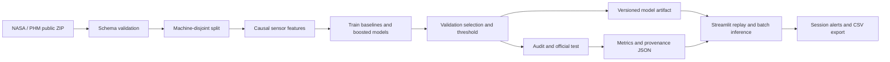

# Requirements and architecture

## User stories

1. As a reviewer, run the demo without downloading data or buying compute.
2. As a maintenance user, see future failure risk and estimated life from available history.
3. As an ML reviewer, inspect model/baseline metrics and reproduce held-out evaluation.
4. As a technician, rehearse alert creation, duplicate suppression, acknowledgement and resolution.
5. As a developer, score schema-compatible history and export predictions.

## Acceptance and tests

Predictions remain unchanged if future observations change; engine histories do not mix; schema errors are rejected; train/validation/audit engine IDs do not overlap; trusted artifact loads and yields finite probabilities; repeated high risk does not produce duplicate alerts. Acknowledgement retains the existing incident. Risk below 75% of the alert threshold resolves the simulated incident. Recovery is a risk-policy transition, not a verified physical repair. The deployment interface performs no device networking.

## Security and support

No secrets, personal data or internal network addresses. No network scan, external notification, or uploads persisted server-side. Uploaded CSV is processed in memory and limited to 100,000 rows after parsing. Public deployments should avoid confidential uploads; this is a public educational demo without authentication. Retrain manually with the documented command. If schema validation fails, compare columns against the downloadable sample. If artifact loading fails, restore matching dependency versions or retrain with the new environment.

## Backlog

Incident-level alert lead time; evaluated calibration; robust domain/OOD validation; persistent alerts with audit logs; automatic monitoring and manually approved retraining; Docker runtime verification; real telemetry integration. Keep these as future work on a resume.
